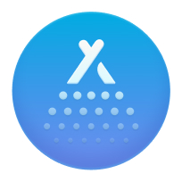

<div align="center">
  

  # MacOptimizer

  **Bộ công cụ dọn dẹp, tối ưu và giám sát macOS với giao diện tiếng Việt**

  <p>
    
    
    
    
    
  </p>
</div>

---

## Tổng quan

MacOptimizer là app macOS viết bằng SwiftUI, tập trung vào ba nhóm việc chính:

- dọn dẹp rác hệ thống, cache, log và file lớn,
- gỡ cài đặt app kèm file liên quan,
- giám sát máy trực tiếp từ menu bar với metric thời gian thực.

Trạng thái repo hiện tại phản ánh các thay đổi gần đây:

- giao diện chính và các luồng menu bar/monitor đã được Việt hóa diện rộng,
- status item trên menu bar đã hỗ trợ `GPU`, `CPU`, `DISK`, `RAM`, `Mạng`, `Pin`,
- tooltip và trang tùy biến status item đã có sẵn,
- app khởi động ẩn theo kiểu menu bar utility và có thể mở cửa sổ chính khi cần,
- script build nội bộ đã xuất được `.app` và `.dmg`.

Ghi chú: repo vẫn giữ checklist sweep cuối cho việc chuẩn hóa nốt text runtime còn sót trong source ở [contracts/vietnamese-only-sweep-checklist.md](contracts/vietnamese-only-sweep-checklist.md).

---

## Trạng thái hiện tại

### Menu bar monitoring

- App khởi động ở chế độ accessory utility và ẩn cửa sổ chính khi mở lần đầu.
- Status item hỗ trợ hiển thị động theo lựa chọn người dùng, không còn là text cố định.
- Có thể bật hoặc tắt từng metric `GPU`, `CPU`, `DISK`, `RAM`, `Mạng`, `Pin`.
- Có thể hiện hoặc ẩn icon app trên status item.
- Tooltip được dùng để giải thích metric và trạng thái hiện tại.
- Trang tùy biến riêng cho menu bar đã có trong nút gear của popup menu bar.
- Detail `CPU` và `RAM` vẫn giữ luồng force-quit nhanh.

### Giám sát hệ thống

- `GPU` đã được đưa vào pipeline đo đạc và hiển thị trên status item.
- `CPU`, `RAM`, `DISK`, `Mạng`, `Pin` được cập nhật theo cadence riêng.
- Hệ thống sampling profile và interval tùy biến đã có cho menu bar monitoring.

### Build và đóng gói

- `./build.sh` tạo app bundle cục bộ tại `build/MacOptimizer.app` và DMG tại `build/MacOptimizer.dmg`.
- `./build_dual_dmg.sh` tạo gói phát hành hai kiến trúc:
  - `build_release/MacOptimizer_v4.0.7_AppleSilicon.dmg`
  - `build_release/MacOptimizer_v4.0.7_Intel.dmg`

---

## Ảnh giao diện

### Menu bar và dashboard

<p align="center">
  
  
  
</p>

### Dọn dẹp và tối ưu

<p align="center">
  
  
  
</p>

### Quyền riêng tư và bảo vệ

<p align="center">
  
  
  
</p>

### Công cụ quản lý ứng dụng

<p align="center">
  
  
  
</p>

---

## Tính năng chính

### Menu bar utility

| Hạng mục | Trạng thái hiện tại |
| --- | --- |
| Metric hỗ trợ | `GPU`, `CPU`, `DISK`, `RAM`, `Mạng`, `Pin` |
| Kiểu hiển thị | Status item động, có thể kèm icon app |
| Tooltip | Có ở status item và UI tùy biến |
| Tùy biến | Bật/tắt metric, sắp thứ tự, preset, sampling profile |
| Force quit | Có trong detail `CPU` và `RAM` |
| Khởi động ẩn | Có, app chạy kiểu accessory utility |

### Bộ công cụ dọn dẹp và tối ưu

| Module | Mục đích |
| --- | --- |
| Smart Clean | Quét nhanh các nhóm dữ liệu thường cần dọn |
| Deep Clean | Rà sâu hơn các file dư thừa và nhóm file lớn |
| Junk Cleaner | Dọn cache, log và file rác hệ thống |
| Large Files | Tìm file lớn, file cũ, file tốn dung lượng |
| Trash | Xem và làm trống Thùng rác |
| File Explorer | Duyệt file hệ thống và thao tác nhanh |
| Optimizer | Tối ưu trạng thái hệ thống và mục khởi động |
| Privacy | Dọn dữ liệu riêng tư trình duyệt và hệ thống |
| Malware | Quét dấu hiệu rủi ro cơ bản |
| App Updater | Kiểm tra cập nhật ứng dụng |
| Uninstaller | Gỡ app kèm file liên quan |

### Gỡ cài đặt ứng dụng

- quét app đã cài,
- hiển thị file liên quan như `Preferences`, `Caches`, `Logs`, `Application Support`,
- gỡ bỏ có chọn lọc,
- ưu tiên đưa vào Thùng rác để an toàn hơn.

---

## Build từ source

### Yêu cầu

- macOS 13 trở lên
- Swift 5.9
- Xcode hoặc Command Line Tools phù hợp

### Build nhanh

```bash
git clone git@github.com:TGalioAutomation/MacOptimizervn.git
cd MacOptimizervn
./build.sh
```

Artifact sau build:

- `build/MacOptimizer.app`
- `build/MacOptimizer.dmg`

Chạy app trực tiếp:

```bash
open build/MacOptimizer.app
```

### Build gói phát hành hai kiến trúc

```bash
./build_dual_dmg.sh
```

Artifact sau build:

- `build_release/MacOptimizer_v4.0.7_AppleSilicon.dmg`
- `build_release/MacOptimizer_v4.0.7_Intel.dmg`

### Build kiểm tra package

```bash
swift build
```

---

## Cấu trúc repo

```text
MacOptimizervn/
├── AppUninstaller/             # Source app macOS
│   ├── AppDelegate.swift       # Khởi động accessory utility và menu bar
│   ├── AppUninstallerApp.swift
│   ├── ContentView.swift
│   ├── MenuBar/                # Menu bar popup, detail, customization
│   ├── SystemMonitorService.swift
│   ├── SmartCleanerService.swift
│   ├── PrivacyScannerService.swift
│   ├── MalwareScanner.swift
│   └── ...
├── contracts/                  # Contract và checklist công việc
├── build.sh                    # Build cục bộ + DMG
├── build_dual_dmg.sh           # DMG Apple Silicon + Intel
├── CHANGELOG_v4.0.7.md         # Ghi nhận trạng thái hiện tại
└── README.md
```

---

## Tài liệu liên quan

- [CHANGELOG_v4.0.7.md](CHANGELOG_v4.0.7.md)
- [CHANGELOG_v4.0.6.md](CHANGELOG_v4.0.6.md)
- [CHANGELOG_v4.0.3.md](CHANGELOG_v4.0.3.md)
- [CHANGELOG_v4.0.2.md](CHANGELOG_v4.0.2.md)
- [CHANGELOG_v4.0.1.md](CHANGELOG_v4.0.1.md)
- [CHANGELOG_v4.0.0.md](CHANGELOG_v4.0.0.md)
- [contracts/vietnamese-only-sweep-checklist.md](contracts/vietnamese-only-sweep-checklist.md)

---

## Ghi chú vận hành

- App hiện được tối ưu cho trải nghiệm menu bar trước, nhưng vẫn có cửa sổ chính cho các luồng dọn dẹp và quản trị chi tiết.
- `GPU` usage phụ thuộc dữ liệu hệ thống macOS; mức chi tiết có thể khác giữa các máy.
- Với các thao tác dọn dẹp nhạy cảm, nên rà soát danh sách file trước khi xóa hàng loạt và ưu tiên đưa vào Thùng rác nếu có thể.
- Nên sao lưu dữ liệu quan trọng trước khi dùng các tính năng dọn dẹp sâu trên máy làm việc chính.

---

<div align="center">
  <strong>MacOptimizer</strong><br/>
  Gọn, nhanh, theo dõi trực tiếp từ menu bar.
</div>
